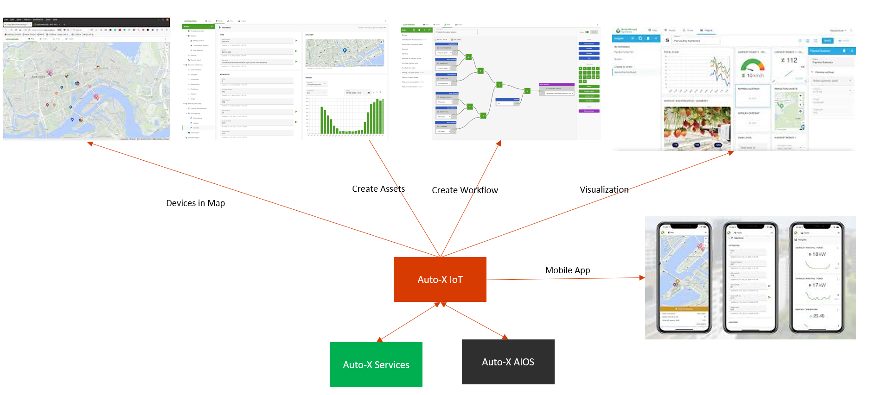

# Auto-X IoT
<div  align="center">
  
</div>
## New Assets
The assets are the same as OpenRemote but with the following additions:
- Gas (Producer and Consumer) Asset
- Water (Producer and Consumer) Asset
- Electricity Meter Asset
- Gas Meter Asset
- Water Meter Asset
- Gauge Asset
- Camera Asset
- Drone Asset

## Quickstart

1. Make sure you have [Docker Desktop](https://www.docker.com/products/docker-desktop) installed (v18+). 
2. In a terminal `cd` to where you just saved the compose file and then run:
```
./gradlew clean installDist
docker-compose -f profile/demo.yml build
docker-compose -f profile/demo.yml up -d
```

## Login credentials
Username: admin  
Password: secret

## Use Guide (Same as OpenRemote)

### Map
The Map page will show your map (see the custom deployment documentation if you like to change the map). You can pan, zoom, and tilt the map. On the map all assets are shown which have a location as well the configuration item show on dashboard set. Assets can both have static or dynamic locations (eg. a car, boat or plane). You will see the direction an asset is facing or moving if the asset includes an attribute called 'direction'. When selecting an asset, a panel will show its attributes and values. The Asset details button in this panel will bring you to the respective Asset page.

If you want to add map layers, you can add GeoJSON based points, lines and shapes. You can directly add GeoJSON files in settings/appearance. For creating GeoJSON files, you can use e.g. https://geojson.io/. For searching existing GeoJSON map layers, you can use https://overpass-turbo.eu/
<div  align="center">
  
</div>

### Assets
The Assets page lets you view and modify assets and their attributes. You will see the asset tree structure on the left, and the details of the selected asset on the right. The asset page contains an Info panel, an Attributes panel, a Location panel (if any) and a History panel.

The Info and Attribute panels will give an overview of all attributes and their value. These can hold meta-, sensor-, or control-data. For attributes of which the value can be changed via the UI, and for which you have the 'write' role as a user, you can type a value and press 'enter' or press the send arrow on the right (e.g. in below example the 'Manufacturer', 'Model' and 'Notes' attributes are manual inputs). Other attribute values could be live readings from sensors or are automatically updated by Rules.
<div  align="center">
  
</div>

### Rules
The Rules page (only available on desktop screen sizes) allows you to build three types of rules:

- WHEN-THEN Rules: When certain conditions created with asset attributes are met, then trigger an action for another attribute.
- FLOW: Process attributes and convert them into new attributes with a simple drag-and-drop interface.
- GROOVY: programming any advanced logic, using attributes in the system. All rules can be set to only be active during a (recurring) event set with the scheduler.
<div  align="center">
  
</div>

### Insights
The Insights page (see figure 11) allows you to create multiple dashboards within the manager UI. You can:

- Define the dashboard behaviour for different screen sizes and optimise the design for a specific screen.
- Share dashboards with other users even as standalone app, or keep your dashboard private.
- Make dashboards public. Note this requires assets to be set as 'public' and attributes as 'public read'.
- Share via the iOS or Android console and benefit push notifications (see figure 12).
- Use eight types of widgets (or extend with your own): Chart, KPI, Gauge, Image, Map, Table, Attribute (with control) and Gateway.
- The gateway widget allows for opening the Manager UI of OpenRemote instances connected as gateways to this instance. See Gateway tunnelling setup for the technical configuration.
<div  align="center">
  
</div>


## Devices

### iOS and Android
The Auto-X IoT including the Insights dashboards, are responsive and can be used on mobile devices.
<div  align="center">
  
</div>


### Timer Camera X

Timer Camera X is a camera module based on ESP32, integrated with ESP32 chip and 8M-PSRAM. The camera (ov3660) with 3 million pixels , DFOV 66.5 ° and shoot 2048x1536 resolution photo, built-in 140mAh battery and LED status indicator, featuring ultra-low power consumption design. There is a reset button under the LED. Through RTC (BM8563), timing sleep and wake-up can be realized. The standby current is only 2μA. After timing photo taking function(one photo per hour) is turned on, the battery can work continuously for more than one month. The module supports Wi-Fi image transmission and USB port debugging. The bottom HY2.0-4P port output can be connected to other peripherals. 

<div  align="center">
  
</div>

Get more information about the hardware at [Timer Camera X](https://docs.m5stack.com/en/unit/timercam_x)

To send image data to Auto-X IoT, please refer to [here](./demos/M5StackTimerCamera/).

###  Raspberry Pi 4 Navio2

Get more information about the hardware at [Navio2](https://docs.px4.io/main/en/flight_controller/raspberry_pi_navio2.html)
<div  align="center">
  
</div>
This demo simulates the following industrial scenarios:

1. Schedule the drone to autonomously collect images of specified objects at some specified places with Auto-X Engine.
2. Exchange drone status with Auto-X IoT during the flight
3. Upload the collected images to Auto-X IoT when drone goes home


## References

- [PX4 Drone Autopilot](https://github.com/PX4/PX4-Autopilot)
- [M5_Camera_Examples](https://github.com/m5stack/M5_Camera_Examples/tree/main)
- [ESP32-S3-EYE](https://github.com/W00ng/ESP32-S3-EYE)
- [FreeRTOS](https://github.com/FreeRTOS/FreeRTOS)
- [mnn-llm](https://github.com/wangzhaode/mnn-llm)